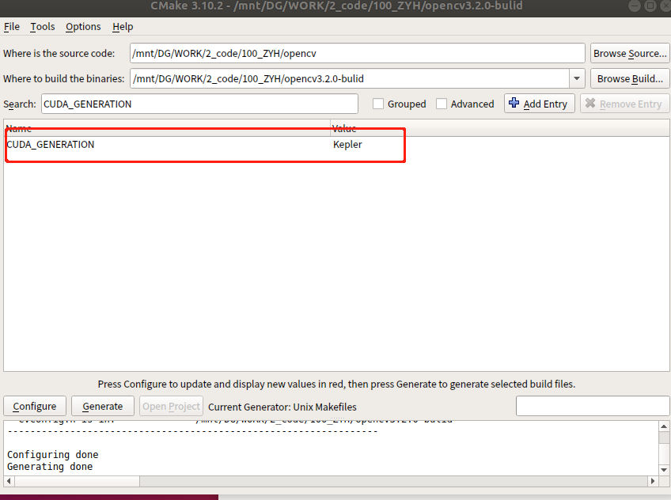
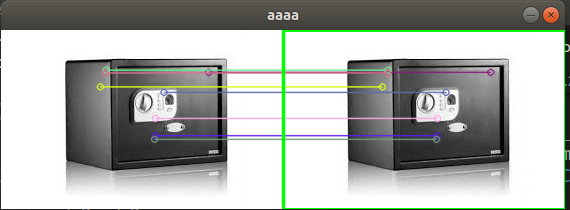

> 本文采用[知识共享署名 4.0 国际许可协议](http://creativecommons.org/licenses/by/4.0/)进行许可，转载时请注明原文链接，图片在使用时请保留全部内容，可适当缩放并在引用处附上图片所在的文章链接。

- [背景](#背景)
- [环境](#环境)
- [安装](#安装)
    - [参考教程](#参考教程)
    - [源码及依赖文件下载](#源码及依赖文件下载)
- [问题解决](#问题解决)
    - [cmake 问题](#cmake-问题)
    - [编译问题解决](#编译问题解决)
- [测试](#测试)
- [其他](#其他)


# 背景
需要用到OpenCV3中使用SIFT和SURF特征提取，需要手动下载opencv和opencv_contrib的源码，然后将两个源码放在一起手动编译安装。

# 环境
* ubuntu18.04
* opencv-3.2.0
* opencv_contrib-3.2.0

# 安装
## 参考教程
[在ubuntu18.04中安装opencv_contrib-3.2.0采坑教程](https://www.cnblogs.com/hiram-zhang/p/12013858.html)  
主要参考上面教程，包含依赖库安装，cmake 配置等，下面会补充使用上述教程中优化和解决的部分编译问题。
## 源码及依赖文件下载
这里主要提供了部分源文件的国内的gitee 下载地址和cmake 自动下载的配置文件(有几率下载不成功这里做下备份)。  
[opencv](https://gitee.com/mirrors/opencv?_from=gitee_search)  
[opencv_contrib](https://gitee.com/mirrors/opencv_contrib?_from=gitee_search)  
[opencv3.2_CMake](https://gitee.com/fromyuhu/opencv3.2_CMake)  

# 问题解决
## cmake 问题
问题：  
```
CMake Error: The following variables are used in this project, but they are set to NOTFOUND.
Please set them or make sure they are set and tested correctly in the CMake files:
CUDA_nppi_LIBRARY (ADVANCED)
linked by target "opencv_cudev" in directory D:/Cproject/opencv/opencv/sources/modules/cudev
linked by target "opencv_cudev" in directory D:/Cproject/opencv/opencv/sources/modules/cudev
linked by target "opencv_test_cudev" in directory D:/Cproject/opencv/opencv/sources/modules/cudev/test
linked by target "opencv_core" in directory D:/Cproject/opencv/opencv/sources/modules/core
linked by target "opencv_core" in directory D:/Cproject/opencv/opencv/sources/modules/core
linked by target "opencv_test_core" in directory D:/Cproject/opencv/opencv/sources/modules/core
linked by target "opencv_perf_core" in directory D:/Cproject/opencv/opencv/sources/modules/core
...
...
```
解决：  
参考：[OpenCV3.3+CUDA9.0+Cmake3.9 环境搭建](https://blog.csdn.net/u014613745/article/details/78310916)  
已经更换的 FindCUDA.cmake OpenCVDetectCUDA.cmake 文件下载地址：  
https://gitee.com/fromyuhu/opencv3.2_CMake  

## 编译问题解决
1. 
问题：  
```
/mnt/DG/WORK/2_code/100_ZYH/opencv/modules/imgcodecs/src/grfmt_exr.hpp:52:10: fatal error: ImfChromaticities.h: 没有那个文件或目录
 #include <ImfChromaticities.h>
```

解决：  
```
sudo apt-get install libopenexr-dev
```

2. 
问题：  
```
/mnt/DG/WORK/2_code/100_ZYH/opencv/modules/videoio/src/cap_gphoto2.cpp:32:10: fatal error: gphoto2/gphoto2.h: 没有那个文件或目录
 #include <gphoto2/gphoto2.h>
```
解决：  
```
sudo apt-get install libgphoto2-dev
```
3. 
问题：  
```
/mnt/DG/WORK/2_code/100_ZYH/opencv3.2.0-bulid/opencv_lapack.h:2:10: fatal error: LAPACKE_H_PATH-NOTFOUND/lapacke.h: 没有那个文件或目录
 #include "LAPACKE_H_PATH-NOTFOUND/lapacke.h"
```
解决：  
```
sudo apt-get install liblapacke-dev checkinstall

修改出现问题的文件，例如我的文件是
opencv-3.2.0/build/opencv_lapack.h
将第二行中的#include"LAPACKE_H_PATH-NOTFOUND/lapacke.h" 修改为#include"lapacke.h"即可
```
4. 
问题：  
```
Unsupported gpu architecture 'compute_20'
```
解决：  
CUDA_GENERATION=Kepler ..  
<div align=center></div>  

# 测试
获取文件： https://gitee.com/fromyuhu/COMMON/tree/master/opencv/surf  

    mkdir bulid   
    cd bulid   
    cmake ..  
    make  
    ./demo

能正常提取匹配特征点说明正常。
<div align=center></div>  

# 其他
笔者在安装的时候，有碰到 libgtk2.0-dev 由于依赖库问题无法安装问题，努力了很久也有搞定，这里说下，如果真的有碰到相的依赖库实在无法安装的问题，可以选择重装系统。笔者曾尝试解决部分库安装问题花费了不少时间，最后也没能解决，耽误了不少时间。