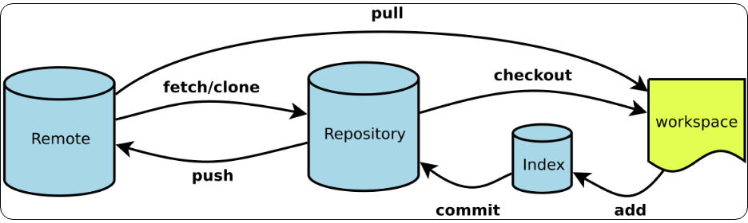
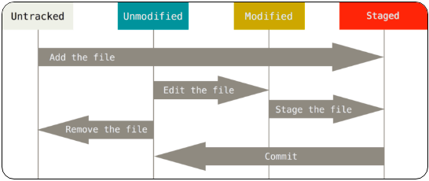
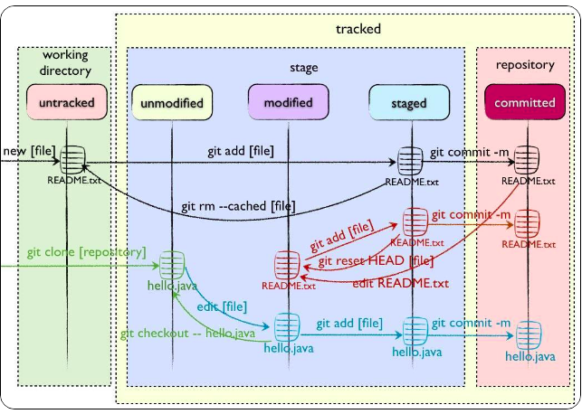
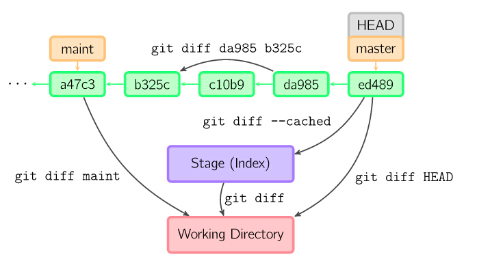

> 本文采用[知识共享署名 4.0 国际许可协议](http://creativecommons.org/licenses/by/4.0/)进行许可，转载时请注明原文链接，图片在使用时请保留全部内容，可适当缩放并在引用处附上图片所在的文章链接。

- [git 部分概念](#git-部分概念)
  - [四个工作区域](#四个工作区域)
  - [工作流程](#工作流程)
  - [文件的四种状态](#文件的四种状态)
- [git 常用命令](#git-常用命令)
  - [git 安装配置](#git-安装配置)
  - [git 乱码](#git-乱码)
  - [Git提交代码的流程](#git提交代码的流程)
  - [git commit --amend](#git-commit---amend)
  - [git 查看](#git-查看)
  - [git diff](#git-diff)
  - [git diff meld](#git-diff-meld)
  - [git rm](#git-rm)
  - [git reset](#git-reset)
  - [git config](#git-config)
  - [git stash](#git-stash)
  - [git alias](#git-alias)
  - [git log](#git-log)
  - [git fetch / merge /pull](#git-fetch--merge-pull)
  - [git tag](#git-tag)
- [git 常用操作](#git-常用操作)
  - [git 修改某次提交](#git-修改某次提交)
  - [修改提交时间](#修改提交时间)
  - [添加子项目/库](#添加子项目库)
  - [移动代码到另一个仓库保留提交点](#移动代码到另一个仓库保留提交点)
  - [全局修改邮箱地址](#全局修改邮箱地址)
  - [拉取远程分支强制覆盖本地](#拉取远程分支强制覆盖本地)
- [常见概念](#常见概念)
  - [Pull Request](#pull-request)
  - [branch](#branch)
  - [开发/发布/缺陷分离模型 (支持 master/develop/feature/release/hotfix 类型分支)](#开发发布缺陷分离模型-支持-masterdevelopfeaturereleasehotfix-类型分支)
- [参考资料](#参考资料)

# git 部分概念
## 四个工作区域
Git本地有四个工作区域：工作目录（Working Directory）、暂存区(Stage/Index)、资源库(Repository或Git Directory)、git仓库(Remote Directory)。



* Workspace： 工作区，就是你平时存放项目代码的地方
* Index / Stage： 暂存区，用于临时存放你的改动，事实上它只是一个文件，保存即将提交到文件列表信息
* Repository： 仓库区（或版本库），就是安全存放数据的位置，这里面有你提交到所有版本的数据。其中HEAD指向最新放入仓库的版本
* Remote： 远程仓库，托管代码的服务器，可以简单的认为是你项目组中的一台电脑用于远程数据交换
## 工作流程
git的工作流程一般是这样的：
１、在工作目录中添加、修改文件；
２、将需要进行版本管理的文件放入暂存区域；
３、将暂存区域的文件提交到git仓库。
因此，git管理的文件有三种状态：已修改（modified）,已暂存（staged）,已提交(committed)
## 文件的四种状态
GIT不关心文件两个版本之间的具体差别，而是关心文件的整体是否有改变，若文件被改变，在添加提交时就生成文件新版本的快照，而判断文件整体是否改变的方法就是用
SHA-1算法计算文件的校验和。

<div align=center></div>

* Untracked:   未跟踪, 此文件在文件夹中, 但并没有加入到git库, 不参与版本控制. 通过git add 状态变为Staged.
*  Unmodify:   文件已经入库, 未修改, 即版本库中的文件快照内容与文件夹中完全一致. 这种类型的文件有两种去处, 如果它被修改, 而变为Modified.如果使用git rm移出版本库, 则成为Untracked文件
* Modified: 文件已修改, 仅仅是修改, 并没有进行其他的操作. 这个文件也有两个去处, 通过git add可进入暂存staged状态, 使用git checkout 则丢弃修改过,返回到unmodify状态, 这个git checkout即从库中取出文件, 覆盖当前修改
* Staged: 暂存状态. 执行git commit则将修改同步到库中, 这时库中的文件和本地文件又变为一致, 文件为Unmodify状态. 执行git reset HEAD filename取消暂存,文件状态为Modified

<div align=center></div>

新建文件--->Untracked
使用add命令将新建的文件加入到暂存区--->Staged
使用commit命令将暂存区的文件提交到本地仓库--->Unmodified
如果对Unmodified状态的文件进行修改---> modified
如果对Unmodified状态的文件进行remove操作--->Untracked
# git 常用命令
## git 安装配置
```bash
sudo apt-get install git
git config --global user.name "yuhuzhang"
git config --global user.email "yuhuzhang@deepglint.com"

git config --global user.name "zhangyuhu"
git config --global user.email "zhangyuhu@didiglobal.com"

ssh-keygen -C 'yuhuzhang@deepglint.com' -t rsa
cat ~/.ssh/id_rsa.pub

sudo apt install gitk
sudo apt-get install git-gui gitk

git config --global core.editor vim

git config --add core.filemode false # 忽略filemode发生改变
```
## git 乱码
编辑 .gitconfig

``` bash
[gui]
  encoding = utf-8
```
```bash
git config --global gui.encoding utf-8  图形界面编码
git config --global i18n.commit.encoding utf-8  提交信息编码
git config --global i18n.logoutputencoding utf-8  输出 log 编码
```
```bash
# "linux\347\263\273\347\273\237\347\256\241\347\220\206.md"

git config --global core.quotepath false

# core.quotepath的作用是控制路径是否编码显示的选项。当路径中的字符大于0x80的时候，如果设置为true，转义显示；设置为false，不转义。
```
## Git提交代码的流程
提交流程
``` bash
git pull --rebase
git add .
git commit -m""
git push origin xxx
```

```bash
git push origin --delete xx # 删除远程分支
git push origin xxx --force # 强制推送到远程分支
git push origin dev-zyh  # 推送到指定分支
```
## git commit --amend
```bash
git commit --amend  # 会通过 core.editor 指定的编辑器进行编辑
git commit --amend --no-edit   # 不会进入编辑器，直接进行提交
git commit --amend --no-edit --author "zhangyuhu <zhangyuhude@163.com>"
```

## git 查看
```bash
git log -1 --stat
git show 548c72f42f51c22dbf2fdf133426e094c59789e4 --stat
git show //最新的commit
git show commitId //指定commit
git show commitId fileName //指定commit的某个文件
```
## git diff

```bash
#比较工作空间中的文件和暂存区文件的差异
git diff [files]

#比较暂存区的文件与之前已经提交过的文件差异
git diff --cached [files]

#比较repo与工作空间中的文件差异
git diff HEAD [files]

#查看本地分支和远程差异
git diff origin/master
git diff origin/HEAD
```
<div align=center></div>


## git diff meld

```bash
sudo apt-get install meld
git config --global diff.tool meld

git difftool master..devel
git difftool dev-adas-730
```


## git rm

```shell
#当我们需要删除暂存区或分支上的文件, 同时工作区也不需要这个文件了, 可以使用（⚠️）
git rm file_path

#当我们需要删除暂存区或分支上的文件, 但本地又需要使用, 这个时候直接push那边这个文件就没有，如果push之前重新add那么还是会有。
git rm --cached file_path
```
## git reset
```shell
#如果出现:将不必要的文件commit 或者 上次提交觉得是错的  或者 不想改变暂存区内容，只是想调整提交的信息
#移除不必要的添加到暂存区的文件
git reset HEAD 文件名
#去掉上一次的提交（会直接变成add之前状态）
git reset HEAD^
#去掉上一次的提交（变成add之后，commit之前状态）
git reset --soft  HEAD^
```
## git config

git config
　　config 配置有system级别 global（用户级别） 和local（当前仓库）三个 设置先从system-》global-》local  底层配置会覆盖顶层配置 分别使用--system/global/local 可以定位到配置文件

```bash
#  查看系统config
git config --system --list

# 查看当前用户（global）配置
git config --global  --list

#  查看当前仓库配置信息
git config -- local    --list

# 显示当前的Git配置
git config --list

# 编辑Git配置文件
git config -e [--global]
```


## git stash

```shell
git stash
git stash save 'message...'可以添加一些注释
git stash list

git stash pop [–index] [stash_id]
git stash pop 恢复最新的进度到工作区。git默认会把工作区和暂存区的改动都恢复到工作区。
git stash pop --index 恢复最新的进度到工作区和暂存区。（尝试将原来暂存区的改动还恢复到暂存区）
git stash pop stash@{1}恢复指定的进度到工作区。stash_id是通过git stash list命令得到的
通过git stash pop命令恢复进度后，会删除当前进度。

git stash apply [–index] [stash_id]
除了不删除恢复的进度之外，其余和git stash pop 命令一样。

git stash drop [stash_id]
删除一个存储的进度。如果不指定stash_id，则默认删除最新的存储进度。

git stash clear
删除所有存储的进度。
```

## git alias
配置别名
``` bash
locate .gitconfig
cd xx
cat .gitconfig

git config --global alias.cazyh 'commit --amend --no-edit --author "zhangyuhu <zhangyuhude@163.com>"'
```
## git log
``` bash
git log --graph

git config --global alias.lg "log --graph --all --pretty=format:'%Cred%h%Creset -%C(yellow)%d%Creset %s %Cgreen(%cr) %C(bold blue)<%an>%Creset' --abbrev-commit --date=relative"
```

## git fetch / merge /pull

<div align=center></div>

git fetch是将远程主机的最新内容拉到本地，用户在检查了以后决定是否合并到工作本机分支中。
而git pull 则是将远程主机的最新内容拉下来后直接合并，即：git pull = git fetch + git merge，这样可能会产生冲突，需要手动解决。

``` bash
# 从远程的origin仓库的master主分支更新最新的版本到origin/master分支上
git fetch origin master
# 比较本地的master分支和origin/master分支的差别
git log -p master..origin/master
# 合并内容到本地master分支
git merge origin/master
```
**尽量少用git pull，多用git fetch和merge**
## git tag

```bash
git tag # 列出已有的标签
git tag -l "v0.1" # 过滤列出已有的标签

git tag -a v1.4 -m "my version 1.4" # 创建标签
git show v1.4 # 查看标签信息和与之对应的提交信息

git tag -d v1.4 # 删除标签
git push origin :refs/tags/v1.4 # 删除远程标签
git push origin --delete v1.4 # 删除远程标签

git checkout v1.4 # 切换到 v1.4 tag
git checkout -b version_v1.4 v1.4 # 切换到 v1.4 tag version_v1.4

git push origin v1.4 # 传送标签到远程仓库服务器
git push origin --tags # 把所有不在远程仓库服务器上的标签全部传送到远程仓库服务器

```
后期打标签
```shell
git log --pretty=oneline

dd1db2ddf7ab23a57b0197abe80167ba4847f185 (HEAD -> master, tag: v0.0.2, origin/master, origin/HEAD) Merge branch 'release-0.0.2'
1967f19f3d2f7b13d18f80dada14da1b8385ecc3 (release-0.0.2) version update :v0.0.2
28b3ff52ea28221314264482d6db6fb7349cf2f8 (develop) Merge branch 'release-0.0.1' into develop
e2d4b5d8eb8407d7141c9846c4459cd1733922fb (release-0.0.1) version update :v0.0.1
2c6ffbce9ffd31e4cee8ca5013924324b49ec898 add bump-version.sh
9c29190a5388ae74f6c983468c8637de40653816 (origin/develop) Merge remote-tracking branch 'origin/hotfix' into develop
5a0a3d928c59a35e3421d2dc029b0487e24a2772 add HotFix/01.fix
78881870f888c519f21025d22869eb5d38b75030 Merge remote-tracking branch 'origin/myfeature_02' into develop
1c9e156e9b54c6714a6f6e8075b8f6cf316ca7c5 Merge remote-tracking branch 'origin/myfeature_01' into develop
b2dc34bc80ce6c9a77a9c399abc7633d09bf9359 Merge branch 'myfeature' into develop
696a92f6e0f77700c1aef37a57abcbc5d69a6673 add TestFile/4.text
5f57182ab7113fdadfa855e4c78237e1a29292b8 Merge branch 'myfeature' into develop
18dd8ba9bb27dc1ff1e414c8538转载说明beb9e904c9032 TestFile/3.test
2124458eef016c34a4d0a0af68dc93166e93ba84 TestFile/2.test
754b56d1c44e49923d679c41839e84e0dfb650d6 add TestFile/1.test
3a8af3c6e7d2852d24b6de6711530cc0ddcc8760 Merge branch 'myfeature' into develop
963672575df191249da5c7f1aaef56afa9cccf2e (origin/feature, feature) add new file
395f4fbd335500cf7c5b51735a27231bea028cd8 (origin/release) Initial commit

git tag -a v0.0.1 5a0a3d928c59a35e3421d2dc029b0487e24a2772

git tag -a v0.0.0 -m "version 0.0.0" 395f4fbd335500cf7c5b51735a27231bea028cd8
```

# git 常用操作
## git 修改某次提交

```shell
commit f2711319a72fa9d3a5486c397c7a10511b970036 (HEAD -> master)
Author: zhangyuhu <zhangyuhude@163.com>
Date:   Mon Aug 24 13:08:12 2020 +0800

    update shll sys folder

commit 1caaf17d90a3288aff8897fca08e33c81a6b9703
Author: yuhuzhang <yuhuzhang@deepglint.com>
Date:   Mon Aug 24 12:56:55 2020 +0800

    add RunPowerOn.sh

commit 8ac823f3e93e82638db5b076952bdcfa12e93cfb
Author: zhangyuhu <zhangyuhude@163.com>
Date:   Fri Aug 21 19:44:06 2020 +0800

    add go test file
```
```bash
git rebase -i 8ac823f3e93e82638db5b076952bdcfa12e93cfb

edit b8901f3 add RunPowerOn.sh
pick 5593c97 update shll sys folder

git cazyh

git rebase --continue
```

```bash
1.git rebase -i 分支~移动数字
2. 选择对应操作
3.git commit --amend
4.git rebase continue
```


## 修改提交时间

```bash
git commit --amend --date="2020-11-28T09:51:07" --no-edit
```

## 添加子项目/库

git submodule add 仓库地址 路径
仓库地址是指子模块仓库地址，路径指将子模块放置在当前工程下的路径。

```bash
git submodule add -f https://gitee.com/fromyuhu/helloword
```

## 移动代码到另一个仓库保留提交点
1. 查看当前分支远程状态
```bash
git remote # 列出已经存在的远程分支
git remote -v # 列出已经存在的远程分支 在每一个名字后面列出其远程url
git remote show origin # 查看远程仓库，以及与本地仓库的关系
```
2. 添加远程仓库
```bash
git remote add <shortname> <url> #添加一个新的远程 Git 仓库，同时指定一个方便使用的简写
git remote add origin_repo_b git@server_ip:/path/repo_b.git
```
3. 推送代码到指定远程
```bash
git push origin_repo_b branch_a
# origin_repo_b:远程 仓库repo_b的名字
# branch_a: 仓库repo_a的branch_a分支
```
4. 克隆仓库repo_b，或者使用页面，检查是否push成功
```bash
git clone git@server_ip:/path/repo_b.git
```
5. 远程仓库的重命名与移除
```bash
git remote rename origin_repo_b zyh_origin # 修改一个远程仓库的简写名

git remote remove origin_repo_b # 移除一个远程仓库
```
## 全局修改邮箱地址
另一个常见的情形是在你开始工作时忘记运行 git config 来设置你的名字与邮箱地址， 或者你想要开源一个项目并且修改所有你的工作邮箱地址为你的个人邮箱地址。 任何情形下，你也可以通过 filter-branch 来一次性修改多个提交中的邮箱地址。 需要小心的是只修改你自己的邮箱地址，所以你使用 --commit-filter：
```bash
$ git filter-branch --commit-filter '
        if [ "$GIT_AUTHOR_EMAIL" = "schacon@localhost" ];
        then
                GIT_AUTHOR_NAME="Scott Chacon";
                GIT_AUTHOR_EMAIL="schacon@example.com";
                git commit-tree "$@";
        else
                git commit-tree "$@";
        fi' HEAD
```
```bash
git filter-branch --commit-filter '
        if [ "$GIT_AUTHOR_EMAIL" = "yuhuzhang@deepglint.com" ];
        then
                GIT_AUTHOR_NAME="zhangyuhu";
                GIT_AUTHOR_EMAIL="zhangyuhude@163.com";
                git commit-tree "$@";
        else
                git commit-tree "$@";
        fi' HEAD
```
```bash
git filter-branch --commit-filter '
        if [ "$GIT_AUTHOR_NAME" = "yuhuzhang" ];
        then
                GIT_AUTHOR_NAME="zhangyuhu";
                GIT_AUTHOR_EMAIL="zhangyuhude@163.com";
                git commit-tree "$@";
        else
                git commit-tree "$@";
        fi' HEAD
```
```bash
git filter-branch --commit-filter '
        if [ "$GIT_AUTHOR_EMAIL" = "zhangyuhude@163.com" ];
        then
                GIT_AUTHOR_NAME="yuhuzhang";
                GIT_AUTHOR_EMAIL="yuhuzhang@deepglint.com";
                git commit-tree "$@";
        else
                git commit-tree "$@";
        fi' HEAD
```
这会遍历并重写每一个提交来包含你的新邮箱地址。 因为提交包含了它们父提交的 SHA-1 校验和，这个命令会修改你的历史中的每一个提交的 SHA-1 校验和， 而不仅仅只是那些匹配邮箱地址的提交。

## 拉取远程分支强制覆盖本地
``` bash
git fetch --all
git reset --hard master
git pull   #可省略
```

```bash
git fetch --all && git reset --hard master && git pull
```
# 常见概念
## Pull Request
有一个仓库，叫Repo A。你如果要往里贡献代码，首先要Fork这个Repo，于是在你的Github账号下有了一个Repo A2,。然后你在这个A2下工作，Commit，push等。然后你希望原始仓库Repo A合并你的工作，你可以在Github上发起一个Pull Request，意思是请求Repo A的所有者从你的A2合并分支。如果被审核通过并正式合并，这样你就为项目A做贡献了。

当你想更正别人仓库里的bug 或者增加 feature 时，要走一个流程：
1. 先 fork 别人的仓库，相当于拷贝一份，不会有人直接让你改修原仓库的
2. clone 到本地分支，做一些 bug fix 或者 feature 开发
3. 发起 pull request 给原仓库，让他看到你修改的 bug
4. 原仓库 review 这个 bug，如果是正确的话，就会 merge 到他自己的项目中

至此，整个 pull request 的过程就结束了。

## branch
分支（branches）是用来标记特定的代码提交，每一个分支通过SHA1sum值来标识，所以对分支进行的操作是轻量级的——你改变的仅仅是SHA1sum值。所以为什么git提倡大家多使用分支，因为它即轻量级又灵活。
* 本地分支(local branches)
```bash
git branch
```
* 远程分支(remote branches)
```bash
git branch -r
```
* 分支在本地存储
.git/refs/head/[本地分支]
.git/refs/remotes/[正在跟踪的分支]

## 开发/发布/缺陷分离模型 (支持 master/develop/feature/release/hotfix 类型分支)
[介绍一个成功的 Git 分支模型(master - hotfix - develop - feature - release)](https://www.cnblogs.com/masahiro/p/12622036.html)

# 参考资料
[gitbook](https://git-scm.com/book/zh/v2)


```
btime = !"for k in `git branch|perl -pe s/^..//`;do echo `git show --pretty=format:\"%Cgreen%ci %Cblue%cr%Creset\" $k|head -n 1`\\\t$k;done|sort"
brtime = !"for k in `git branch -r|perl -pe s/^..//`;do echo `git show --pretty=format:\"%Cgreen%ci %Cblue%cr%Creset\" $k|head -n 1`\\\t$k;done|sort"
```

