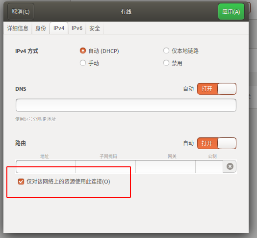

- [1. ununtu 设置](#1-ununtu-设置)
  - [1.1. ubuntu 自动挂载机械硬盘](#11-ubuntu-自动挂载机械硬盘)
  - [1.2. ubuntu 开机自启动程序](#12-ubuntu-开机自启动程序)
  - [1.3. Ubuntu主机的NFS共享文件夹](#13-ubuntu主机的nfs共享文件夹)
  - [1.4. 软链接](#14-软链接)
    - [1.4.1. 创建软链接](#141-创建软链接)
    - [1.4.2. 删除软链接](#142-删除软链接)
  - [1.5. Ubuntu终端显示Git当前所在分支](#15-ubuntu终端显示git当前所在分支)
  - [1.6. \[SSH\] 使用别名代替IP地址登录](#16-ssh-使用别名代替ip地址登录)
  - [1.7. ubuntu 显示字体大小设置](#17-ubuntu-显示字体大小设置)
  - [1.8. ubuntu 设置wifi 上网，有线连接局域网设备](#18-ubuntu-设置wifi-上网有线连接局域网设备)
  - [1.9. 快捷键](#19-快捷键)
    - [1.9.1. 文件管理器](#191-文件管理器)
  - [1.10. 任务栏设置](#110-任务栏设置)
  - [1.11. 修改主机名](#111-修改主机名)
- [2. 常用软件安装](#2-常用软件安装)
  - [2.1. vim](#21-vim)
  - [2.2. 微信](#22-微信)
  - [2.3. net-tools](#23-net-tools)
  - [2.4. opencv](#24-opencv)
  - [2.5. openssl](#25-openssl)
  - [2.6. cmake](#26-cmake)
  - [2.7. terminator](#27-terminator)
  - [2.8. tree](#28-tree)
  - [2.9. doublecmd](#29-doublecmd)
  - [2.10. gnome-tweaks](#210-gnome-tweaks)
  - [2.11. VLC](#211-vlc)
  - [2.12. Typora](#212-typora)
  - [2.13. Samba](#213-samba)
  - [2.14. 截图工具 flameshot](#214-截图工具-flameshot)
  - [2.15. Finalshell](#215-finalshell)
  - [2.16. 搜狗输入法](#216-搜狗输入法)
  - [2.17. ubuntu  删除应用显示图标](#217-ubuntu--删除应用显示图标)
  - [2.18. ZSH 和 oh-my-sh](#218-zsh-和-oh-my-sh)
  - [2.19. clash](#219-clash)
  - [2.20. jq 工具](#220-jq-工具)
  - [2.21. screenkey](#221-screenkey)
  - [2.22. pycharm](#222-pycharm)
  - [2.23. android stduio](#223-android-stduio)
  - [内网穿透 cpolar](#内网穿透-cpolar)

# 1. ununtu 设置

## 1.1. ubuntu 自动挂载机械硬盘
[Ubuntu18.04 自动挂载硬盘](https://www.cnblogs.com/jiahangok/p/12015441.html)

## 1.2. ubuntu 开机自启动程序
参考：
[ubuntu-18.04 设置开机启动脚本](https://www.cnblogs.com/airdot/p/9688530.html)

1. 建立rc-local.service文件
``` shell
sudo vi /etc/systemd/system/rc-local.service
```
rc-local.service:
```Bash
[Unit]
Description=/etc/rc.local Compatibility
ConditionPathExists=/etc/rc.local

[Service]
Type=forking
ExecStart=/etc/rc.local start
TimeoutSec=0
StandardOutput=tty
RemainAfterExit=yes
SysVStartPriority=99

[Install]
WantedBy=multi-user.target
```
2. 创建文件rc.local　　
```shell
sudo vi /etc/rc.local
```
rc.local :
```Bash
#!/bin/sh -e
#
# rc.local
#
# This script is executed at the end of each multiuser runlevel.
# Make sure that the script will "exit 0" on success or any other
# value on error.
#
# In order to enable or disable this script just change the execution
# bits.
#
# By default this script does nothing.
cd /usr/local
./RunPowerOn.sh
exit 0
```
[RunPowerOn.sh](https://gitee.com/fromyuhu/COMMON/blob/master/shell/sys/RunPowerOn.sh)

3. 给rc.local加上权限/启用服务/启动服务并检查状态
```bash
sudo chmod +x /etc/rc.local
sudo systemctl enable rc-local
sudo systemctl start rc-local.service
sudo systemctl status rc-local.service
```
4. 重启并检查日志文件
```bash
ls /mnt/DG/DATA/LOG/sys_start/
cat xxx
```

## 1.3. Ubuntu主机的NFS共享文件夹
ubuntu:
```shell
apt-get install nfs-common nfs-kernel-server
vi /etc/exports

sudo gedit /etc/exports
```
```
/home/zyh/T3-libra *(rw,sync,no_root_squash,no_subtree_check)
/home/zyh/DATA *(rw,sync,no_root_squash,no_subtree_check)
/home/zyh/sensor_test *(rw,sync,no_root_squash,no_subtree_check)
/mnt/DG/DATA/DATA/RGBD2 *(rw,sync,no_root_squash,no_subtree_check)
/mnt/DG/DATA/DATA/RGBD *(rw,sync,no_root_squash,no_subtree_check)
/mnt/DG/DATA/DATA/test_roi *(rw,sync,no_root_squash,no_subtree_check)
/mnt/DG/WORK/2_code/4_T3R/rknn_demo *(rw,sync,no_root_squash,no_subtree_check)
/mnt/DG/WORK/2_code/99_TEST/T3RHeadDetectTest *(rw,sync,no_root_squash,no_subtree_check)
/mnt/DG/WORK/2_code/99_TEST/t3r_pressure_test *(rw,sync,no_root_squash,no_subtree_check)
/mnt/DG/WORK/2_code/99_TEST/rockchip_mpp *(rw,sync,no_root_squash,no_subtree_check)
/mnt/DG/WORK/2_code/99_TEST/mpp *(rw,sync,no_root_squash,no_subtree_check)
/mnt/DG/WORK/2_code/4_T3R/libra_v3/release *(rw,sync,no_root_squash,no_subtree_check)
/mnt/DG/DATA/T3R/encoder/image *(rw,sync,no_root_squash,no_subtree_check)
/mnt/DG/WORK/2_code/4_T3R/HaomuF *(rw,sync,no_root_squash,no_subtree_check)
/mnt/DG/WORK/2_code/9_other/StereoCamera *(rw,sync,no_root_squash,no_subtree_check)
/mnt/DG/WORK/2_code/9_other/librealsense *(rw,sync,no_root_squash,no_subtree_check)
/mnt/DG/ZYH/COMMON/Multimedia/rkmmp *(rw,sync,no_root_squash,no_subtree_check)

/home/ubuntu/workspace/yuhuzhang/mpp  *(rw,sync,no_root_squash,no_subtree_check)

# home
/mnt/DATA/CODE/beagle-bone *(rw,sync,no_root_squash,no_subtree_check)
mount -t nfs -o nolock 192.168.100.189:/mnt/DATA/CODE/beagle-bone
```


```
sudo service nfs-kernel-server restart

alias nfsstart='sudo service nfs-kernel-server restart'
vi ~/.bashrc
source ~/.bashr
```
T3
```shell
mount -t nfs -o nolock 192.168.101.15:/home/zyh/code /mnt
ls  /mnt

mount -t nfs -o nolock 192.168.101.98:/media/zyh/DG/WORK/2_code/1_T3/libra_v3  /mnt

mount -t nfs -o nolock 192.168.100.189:/home/zyh/T3-libra /root/zyh_libra

mount -t nfs -o nolock 192.168.100.189:/home/zyh/T3-libra /home/ubuntu/zyh_libra

mount -t nfs -o nolock 192.168.100.189:/home/zyh/T3-libra /home/zyh_libra

mount -t nfs -o nolock 192.168.100.189:/home/zyh/sensor_test /home/sensor_test

T4DEMO
mount -t nfs -o nolock 192.168.100.189:/mnt/DG/WORK/2_code/3_T4/libra_v3/release /home/deepglint/zyh/zyh_libra

RK
mount -t nfs -o nolock 192.168.100.189:/mnt/DG/WORK/2_code/4_T3R/rknn_demo /home/toybrick/Rockchip/zyh/rknn_demo
mount -t nfs -o nolock 192.168.100.189:/mnt/DG/WORK/2_code/4_T3R/rknn_demo/rknn_demo /home/toybrick/Rockchip/zyh/rknn_demo
mount -t nfs -o nolock 192.168.100.189:/home/zyh/T3-libra /home/toybrick/Rockchip/zyh/zyh_libra
mount -t nfs -o nolock 192.168.100.189:/mnt/DG/WORK/2_code/99_TEST/mpp /home/toybrick/Rockchip/zyh/mpp
mount -t nfs -o nolock 192.168.100.189:/mnt/DG/WORK/2_code/4_T3R/libra_v3/release
mount -t nfs -o nolock 192.168.100.189:/mnt/DG/DATA/T3R/encoder/image /home/deepglint/zyh/image
mount -t nfs -o nolock 192.168.100.189:/mnt/DG/WORK/2_code/99_TEST/t3r_pressure_test /home/toybrick/Rockchip/zyh/t3r_pressure_test
mount -t nfs -o nolock 192.168.100.189:/mnt/DG/DATA/T3R/encoder/image /home/toybrick/Rockchip/zyh/image

mount -t nfs -o nolock 192.168.100.189:/mnt/DG/WORK/2_code/9_other/StereoCamera /home/toybrick/Rockchip/zyh/StereoCamera

mount -t nfs -o nolock 192.168.100.189:/mnt/DG/WORK/2_code/4_T3R/rknn_demo/rknn_demo /home/zyh/rknn_demo

mount -t nfs -o nolock 192.168.100.189:/mnt/DG/WORK/2_code/4_T3R/HaomuF /home/toybrick/Rockchip/zyh/HaomuF

mount -t nfs -o nolock 192.168.100.189:/home/zyh/T3-libra /home/zyh_libra

mount -t nfs -o nolock 192.168.100.189:/home/zyh/BeagleBone /root/BeagleBone
```
```bash
////////////////////////////////////////////////////////////////////////////////
mount -t nfs -o nolock 192.168.100.189:/home/zyh/T3-libra /home/deepglint/zyh/zyh_libra
mount -t nfs -o nolock 192.168.100.189:/mnt/DG/DATA/DATA/RGBD /home/deepglint/zyh/DATA
mount -t nfs -o nolock 192.168.100.189:/mnt/DG/DATA/DATA/test_roi /home/deepglint/zyh/test_roi


mount -t nfs -o nolock 192.168.100.189:/mnt/DG/WORK/2_code/99_TEST/t3r_pressure_test/T3RHeadDetectTest /home/deepglint/zyh/t3r_pressure_test

mount -t nfs -o nolock 192.168.100.189:/mnt/DG/WORK/2_code/99_TEST/libra_v3 /home/deepglint/zyh/sensor_test

mount -t nfs -o nolock 192.168.100.189:/mnt/DG/WORK/2_code/99_TEST/mpp /home/firefly/zyh/mpp
```


```bash
#firefly

mount -t nfs -o nolock 192.168.100.189:/mnt/DG/WORK/2_code/99_TEST/t3r_pressure_test /home/firefly/zyh/t3r_pressure_test
mount -t nfs -o nolock 192.168.100.189:/mnt/DG/WORK/2_code/9_other/librealsense /home/firefly/zyh/librealsense

mount -t nfs -o nolock 192.168.101.63:/home/ubuntu/workspace/yuhuzhang/mpp /home/firefly/zyh/mpp
mount -t nfs -o nolock 192.168.100.189:/mnt/DG/WORK/2_code/99_TEST/mpp /home/firefly/zyh/mpp

mount -t nfs -o nolock 192.168.100.189:/mnt/DG/ZYH/COMMON/Multimedia/rkmmp /home/firefly/zyh/rkmpp

mount -t nfs -o nolock 192.168.100.189:/mnt/DG/WORK/2_code/3_T4/aiva /home/firefly/zyh/aiva
```


## 1.4. 软链接

### 1.4.1. 创建软链接
```shll

# rk3399
sudo ln -fs /mnt/DG/DATA/tool_chain/aarch64-buildroot-linux-gnu_rk3399-buildroot /usr/local/aarch64-rk3399-linux-toolchain-libra-v4

# aarch64-himix100
sudo ln -fs /mnt/DG/DATA/tool_chain/aarch64-buildroot-linux-gnu_sdk-buildroot /usr/local/aarch64-himix100-linux-toolchain-libra-v3

# gnueabihf
sudo ln -fs /mnt/DG/DATA/tool_chain/arm-buildroot-linux-gnueabihf_sdk-buildroot /usr/local/arm-linux-gnueabihf-toolchain-libra-v3

# BeagleBone
sudo ln -fs /mnt/DG/DATA/tool_chain/arm-buildroot-linux-gnueabihf_sdk-buildroot /usr/local/arm-linux-gnueabihf-toolchain

# code
sudo ln -fs /mnt/DG/WORK/2_code/1_T3/libra_v3 /home/zyh/T3-libra
sudo ln -fs /mnt/DG/WORK/2_code/100_ZYH/COMMON/BeagleBone /home/zyh/BeagleBone
sudo ln -fs /mnt/DG/WORK/2_code/99_TEST/libra_v3 /home/zyh/sensor_test
```

### 1.4.2. 删除软链接
正确的是：rm -rf hb_link
错误的是：rm -rf hb_link/ 这个会把整个目录都删了
备注：想要删除链接文件要用以下命令 rm   /home/hb_link 只是少了一个“ / ” 删除的 就是链接文件, 也就是在文件的最后不要加上/

## 1.5. Ubuntu终端显示Git当前所在分支
* cd ~
* vi .bashrc
* 插入代码
```shell
function git_branch {
   branch="`git branch 2>/dev/null | grep "^\*" | sed -e "s/^\*\ //"`"
   if [ "${branch}" != "" ];then
       if [ "${branch}" = "(no branch)" ];then
           branch="(`git rev-parse --short HEAD`...)"
       fi
       echo " ($branch)"
   fi
}

export PS1='\u@\h \[\033[01;36m\]\W\[\033[01;32m\]$(git_branch)\[\033[00m\] \$ '
```
* source ./.bashrc

## 1.6. [SSH] 使用别名代替IP地址登录
如果要想把前面的ssh root@192.168.1.2使用一个好记的别名（比如：test），则可以在~/.ssh/config添加如下的配置：
```shell
Host test
    HostName 192.168.1.2
    User root
```
保存文件后，即可以用下面的方式登录了：
```shell
$ ssh test
```

## 1.7. ubuntu 显示字体大小设置

终端命令：
安装gnome-tweaks桌面配置工具;
```
sudo apt install gnome-tweaks
```
Alt+F2 在运行窗口输入 gnome-tweaks 命令，回车;
打开的优化窗口中，字体一栏，调整缩放比例（如1.5则会放大）。

## 1.8. ubuntu 设置wifi 上网，有线连接局域网设备
配置有线网如下
<div align=center></div>

## 1.9. 快捷键
设置-> 设备 -> 键盘


### 1.9.1. 文件管理器
```bash
nautilus .
```


## 1.10. 任务栏设置


## 1.11. 修改主机名


# 2. 常用软件安装

[自动安装](https://gitee.com/fromyuhu/COMMON/tree/master/tools/install)

## 2.1. vim
```bash
sudo apt-get install vim
wget -qO- https://raw.github.com/ma6174/vim/master/setup.sh | sh -xY
```

## 2.2. 微信

````bash
wget -O- https://deepin-wine.i-m.dev/setup.sh | sh
sudo apt-get install deepin.com.wechat
````

[Ubuntu通过deepin-wine安装wechat和wechat Work](https://blog.csdn.net/wangxiao7474/article/details/103345648)

## 2.3. net-tools
```bash
sudo apt install net-tools
```

## 2.4. opencv
```bash
sudo apt-get install libopencv-dev
```

## 2.5. openssl
```bash
sudo apt-get install openssl
sudo apt-get install libssl-dev
```

## 2.6. cmake
```bash
sudo apt install cmake
```

## 2.7. terminator
```bash
sudo apt-get install terminator
```

快捷键：
Ctrl-E(注意是大E要按住Shift)可以垂直分割终端
Ctrl-O 可水平分割终端
按住Alt然后按上下左右可以在不同的分割窗中切换
Ctrl-D 可以关闭分割窗
terminator配置文件 ：~/.config/terminator/config

``` json
font = Monaco 10 #设置体字
background_color = "#204070" # 背景颜色
foreground_color = "#F0F0F0" # 字体颜色
cursor_blink = True # 设置光标
scrollbar_position = disabled # 禁用滚动条
titlebars = no # 禁用标题栏
background_darkness = 0.4
background_type = transparent # 背景类型可以设置为图片
```
更多配置：

```bash
man terminator_config
```


## 2.8. tree
```bash
sudo apt install tree
```

## 2.9. doublecmd
文件管理工具
```
sudo add-apt-repository ppa:alexx2000/doublecmd
sudo apt-get update
sudo apt-get install doublecmd-gtk

sudo apt-get remove doublecmd-*
```

## 2.10. gnome-tweaks
unutu 桌面配置
```shell

# 安装
sudo apt-get gnome-tweaks

# 启动
gnome-tweaks
```

## 2.11. VLC


## 2.12. Typora

[Linux安装及美化Typora详细步骤](https://blog.csdn.net/y_universe/article/details/107184300)

## 2.13. Samba

Samba 是种用来让UNIX系列的操作系统与微软Windows操作系统的SMB / CIFS（服务器消息块/通用Internet文件系统）网络协议做链接的自由软件。第三版不仅可访问及分享SMB的文件夹及打印机，本身还可以集成入Windows Server的网域，扮演为网域控制站（域控制器）以及加入Active Directory成员。简而言之，此软件在Windows与UNIX系列操作系统之间搭起一座桥梁，让两者的资源可互通有无。

```bash

# 安装
sudo apt-get install samba

# 查看是否安装成功
samba

# samba 配置文件路径
/etc/samba/smb.conf

# 修改配置文件 - 文件最后添加
[ZYH-DATA]
    comment = zyh ubuntu data
    path = /mnt/DG
    public = yes
    browseable = yes
    public = yes
    writeable = yes
    read only = no
    valid users = zyh
    create mask = 0777
    directory mask = 0777
    force user = nobody
    force group = nogroup
    available = yes

# 添加密码
 sudo smbpasswd -a zyh

# 重启samba 服务器
sudo service smbd restart

# win 访问
  \\+ ip
```

## 2.14. 截图工具 flameshot
```bash

# 安装
sudo apt-get install flameshot

# 手动下载
https://github.com/flameshot-org/flameshot/releases

# 启动
flameshot gui
```

## 2.15. Finalshell

[github release](https://github.com/flameshot-org/flameshot/releases)

```bash
rm -f finalshell_install_linux.sh
wget www.hostbuf.com/downloads/finalshell_install_linux.sh
chmod +x finalshell_install_linux.sh
./finalshell_install_linux.sh
```

安装路径

```shell
/usr/lib/FinalShell/
```

配置文件路径

```shell
/home/$USER/.finalshell/
```


## 2.16. 搜狗输入法

https://shurufa.sogou.com/linux/guide

## 2.17. ubuntu  删除应用显示图标

1. 删除系统自带的图标

 ```shell
 sudo nautilus /usr/share/applications
 ```

2. 删除wine等软件安装的自定义图标
 ```
 sudo nautilus ~/.local/share/applications
 ```


## 2.18. ZSH 和 oh-my-sh

```

# zsh
sudo apt-get install zsh

# oh-my-sh
sh -c "$(curl -fsSL https://raw.github.com/robbyrussell/oh-my-zsh/master/tools/install.sh)"

# 设置默认终端
chsh -s /bin/zsh root

# 切换回bash也是相同的方法
chsh -s /bin/bash root
```

## 2.19. clash
参考 ：[ubuntu 20.04 配置使用 clash for linux](http://www.ptbird.cn/ubuntu-2004-clash-for-linux.html)

1. 下载地址

   ```
   https://github.com/Dreamacro/clash
   wget -O clash.gz https://github.com/Dreamacro/clash/releases/download/v1.4.1/clash-linux-amd64-v1.4.1.gz
   ```

2. 安装

   ```
   gzip -f clash.gz -d
   chmod +x clash

   cp clash /usr/bin

   vi .bashrc
   alias clash='sudo ./usr/bin/clash -d ~/.config/clash/'

   ./clash
   ```

3. 配置

   - 拷贝 mac / win 上配置文件到ubuntu

   - 使用 Web 工具管理 clash

     地址：http://clash.razord.top/#/proxies

     

   - 配置 ubunutu 网络代理

     打开 设置 -> 网络 -> 网络代理

     配置 HTTP 代理和 socket 代理 分别为上面的端口号

     

   - 其他问题

     - git clone 报错 ：Failed to receive SOCKS4 connect request ack.

       因为 clash 代理的 socket5，github 是 socket4

   ```
   # 7891 是clash 代理 socket 的端口
   git config --global http.proxy 'socks5://127.0.0.1:7891'
   git config --global https.proxy 'socks5://127.0.0.1:7891'
   ```


## 2.20. jq 工具

[官网](https://stedolan.github.io/jq/)

```bash
sudo apt-get install jq

# json 格式化
cat Recfront_20200916_095044_refine.json |jq . >data_2.json
```

## 2.21. screenkey

1. 下载 https://www.thregr.org/~wavexx/software/screenkey/

2. 安装

```bash

tar xvf screenkey-1.5.tar.gz
cd screenkey-1.5
sudo ./setup.py install
cd data
sudo cp ./screenkey.desktop /usr/share/applications/
```

3. 使用

```bash
screenkey
```

4. 设置

参考 ： https://gitlab.com/screenkey/screenkey#interactive-placement

```
screenkey -p fixed -g 30%x10%+65%-10%
```


## 2.22. pycharm

- 下载 ： https://www.jetbrains.com/pycharm/download/#section=linux

- 解压
- cp  xxx/* /opt/pycharm
- alias pycharm='cd /opt/pycharm/bin && ./pycharm.sh &'


## 2.23. android stduio

- 下载 https://developer.android.google.cn/studio
- 解压
- cp xxx/* /opt/android-studio/
- alias android='cd /opt/android-studio/bin && ./studio.sh &'


## 内网穿透 cpolar

- cpolar一键安装脚本
```bash
curl -L https://www.cpolar.com/static/downloads/install-release-cpolar.sh | sudo bash
```

- 配置cpolar开机自启动
```bash
sudo systemctl enable cpolar
sudo systemctl start cpolar
sudo systemctl status cpolar
```

- 获取ssh隧道的公网地址
http://localhost:9200 配置

- 远程登陆
```bash
ssh linux用户名@cpolar所生成的公网地址 -p XXXXX（cpolar生成的端口号）
```