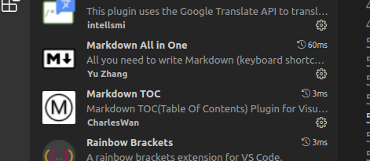

> 本文采用[知识共享署名 4.0 国际许可协议](http://creativecommons.org/licenses/by/4.0/)进行许可，转载时请注明原文链接，图片在使用时请保留全部内容，可适当缩放并在引用处附上图片所在的文章链接。


<!-- TOC -->

- [1. 资料](#1-资料)
- [2. vs code 快捷键](#2-vs-code-快捷键)
  - [2.1. 将下一个查找匹配项添加到选择](#21-将下一个查找匹配项添加到选择)
- [3. VS 插件](#3-vs-插件)
  - [3.1. Markdown TOC](#31-markdown-toc)
  - [3.2. Markdown Preview Enhanced](#32-markdown-preview-enhanced)
  - [3.3. Markdown All in One](#33-markdown-all-in-one)
  - [3.4. GitLens](#34-gitlens)
  - [3.5. Code Spell Checker](#35-code-spell-checker)
  - [3.6. Remote - SSH](#36-remote---ssh)
  - [3.7. vscode-fileheader](#37-vscode-fileheader)
  - [3.8. Rainbow Brackets](#38-rainbow-brackets)
  - [3.9. vscode-pdf](#39-vscode-pdf)
  - [3.10. vscode-drawio](#310-vscode-drawio)
  - [3.11. Comment Translate](#311-comment-translate)
  - [3.12. shellman](#312-shellman)
  - [3.13. shell-format](#313-shell-format)
  - [3.14. shellcheck](#314-shellcheck)
- [4. 问题及配置](#4-问题及配置)
  - [4.1. ubuntu vscode 字体间隔大](#41-ubuntu-vscode-字体间隔大)
  - [4.2. ubuntu vscode 代码空格小](#42-ubuntu-vscode-代码空格小)
  - [4.3. 显示空格和tab](#43-显示空格和tab)
  - [4.4. 保存去除行尾字符](#44-保存去除行尾字符)
  - [4.5. markdown 去除 保存去除行尾字符](#45-markdown-去除-保存去除行尾字符)
  - [4.6. linux下vscode编写cpp占用内存过高问题](#46-linux下vscode编写cpp占用内存过高问题)
  - [4.7. 设置忽略文件](#47-设置忽略文件)

<!-- /TOC -->
# 1. 资料
[官方文档](https://code.visualstudio.com/docs)
[第一次使用VS Code时你应该知道的一切配置](https://zhuanlan.zhihu.com/p/62913725)

# 2. vs code 快捷键

```
The cmd key for Windows is ctrl.

Shortcuts	Functionality
cmd-k v or ctrl-k v	Open preview to the Side
cmd-shift-v or ctrl-shift-v	Open preview
ctrl-shift-s	Sync preview / Sync source
shift-enter	Run Code Chunk
ctrl-shift-enter	Run all Code Chunks
cmd-= or cmd-shift-=	Preview zoom in
cmd-- or cmd-shift-_	Preview zoom out
cmd-0	Preview reset zoom
esc	Toggle sidebar TOC

```
## 2.1. 将下一个查找匹配项添加到选择
vsCode多选多个元素进行统一修改
```json
{
  "key": "ctrl+d",
  "command": "editor.action.addSelectionToNextFindMatch",
  "when": "editorFocus"
}
```

# 3. VS 插件


## 3.1. Markdown TOC

自动生成目录
[VScode markdown md TOC 插件目录生成错误auto](https://www.cnblogs.com/heenhui2016/p/12691690.html)
搜索eol
改为'\n'

## 3.2. Markdown Preview Enhanced
markdown 预览

## 3.3. Markdown All in One

## 3.4. GitLens
[VsCode中好用的git源代码管理插件GitLens](https://www.jianshu.com/p/a91cb8a2e55d)

## 3.5. Code Spell Checker
代码拼写检查工具

## 3.6. Remote - SSH
连接远程主机

## 3.7. vscode-fileheader
自动生成文件头

```
/*   \r\n* @file      xxx\r\n* @brief     xxx\r\n* @author    ZYH\r\n* @version   v0.1\r\n* @date      2020/07/22\r\n* @copyright 2019, Deepglint All rights reserved.\r\n*/
```

## 3.8. Rainbow Brackets
彩虹括号

## 3.9. vscode-pdf
PDF 查看器

## 3.10. vscode-drawio
VSCode Drawio

## 3.11. Comment Translate
VSCode 注释翻译

## 3.12. shellman
编辑过程中会有代码提示

## 3.13. shell-format
右键 -> 格式化文档（Ctrl + Alt + L）

## 3.14. shellcheck
语法错误检查插件
安装shellcheck（shellcheck插件依赖于shellcheck） : sudo apt-get install shellcheck
在编辑过程中，会提示语法错误

# 4. 问题及配置
## 4.1. ubuntu vscode 字体间隔大
修改："terminal.integrated.fontFamily": "monospace"，

## 4.2. ubuntu vscode 代码空格小
修改： " Editor:Font Family":'monospace'

## 4.3. 显示空格和tab
修改 ：" Editor: Render Whitespace ":all

## 4.4. 保存去除行尾字符
启用 ：trimTrailingWhitespace

## 4.5. markdown 去除 保存去除行尾字符
markdown 文件根目录配置
```json
{
    "files.trimTrailingWhitespace": false
}
```

## 4.6. linux下vscode编写cpp占用内存过高问题

intelli Sense Cache Size 默认大小为5G,将其改为2048(2G)或者其他任意，不要太大。

## 4.7. 设置忽略文件

```bash
 "files.exclude": {
        "*.metadata": true,
        "*.settings": true,
        "**/*.pyc": true, //隐藏所有pyc文件
        "**/*.meta": true, //隐藏所有meta文件
        "**/*.prefab": true, //隐藏所有prefab文件
        "**/*.d.ts": true, //隐藏所有d.ts文件
        "**/*.fnt": true,
        "**/*.sln": true,
        "**/*.csproj": true,
        "**/.vscode": true,
        "**/*.anim": true,
        "**/*.controller": true,
        "**/Logs": true,
        "**/[Pp]lugins": true, //使用中括号时表示不区分大小写
        "**/[Mm]aterials": true,
        "**/[Aa]nimation": true,
        "**/[Pp]ackages": true,
        "**/[Tt]extures": true,
        "**/[Ss]cenes": true,
        "**/temp": true, //隐藏temp文件夹
        "**/library": true, //隐藏library文件夹
        "**/audio": true, //隐藏audio文件夹
        "**/video": true, //隐藏video文件夹
    }
```
